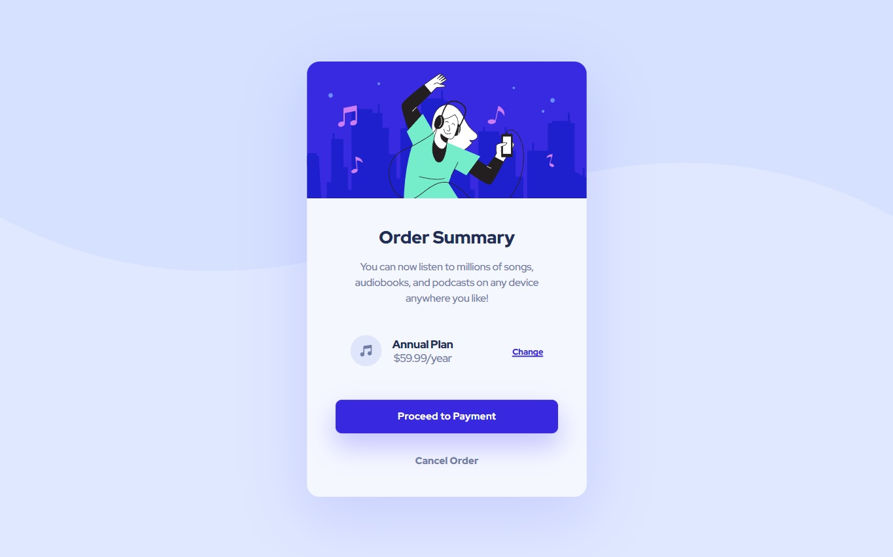

# Frontend Mentor - Order summary card solution

This is a solution to the [Order summary card challenge on Frontend Mentor](https://www.frontendmentor.io/challenges/order-summary-component-QlPmajDUj). Frontend Mentor challenges help you improve your coding skills by building realistic projects. 

## Table of contents

- [Overview](#overview)
  - [The challenge](#the-challenge)
  - [Screenshot](#screenshot)
  - [Links](#links)
- [My process](#my-process)
  - [Built with](#built-with)
  - [What I learned](#what-i-learned)
  - [Continued development](#continued-development)
  - [Useful resources](#useful-resources)
- [Author](#author)

## Overview

### The challenge

Users should be able to:

- See hover states for interactive elements

### Screenshot
<div>
  
  
</div>

### Links

- Solution URL: [My solution URL](https://github.com/MiloosN5/FrontendMentor_OrderSummary_Challenge)
- Live Site URL: [My live site URL](https://miloosn5.github.io/FrontendMentor_OrderSummary_Challenge/)


## My process

### Built with

- Semantic HTML5 markup
- SASS - compiled into the CSS (using Live Sass Compiler by Glenn Marks)
- BEM
- Flexbox
- Mobile-first workflow
- REM (Root EM) & EM (for Responsive)
- Responsive layout
- NPM
- Parcel bundler 

### What I learned

* Getting my project on the localhost using Parcel bundler. When using this bundler, we link our main sass file into the index.html, rather than linking compiled css file. Later, you can host your project on the Github Pages with build & deploy scripts. 
Note: After executing build script, Parcel generated urls with "/" that Github Pages can't resolve. The solution is to have "./" instead of "/". For that purpose, you should add "--public-url ./"" in build script.
* Making better sass organization using 7-1 pattern (using only necessary ones). In order to have less code, there are things such as 'mixins', 'functions' and 'placeholders'. All of them were used in this project.
* For better font responsiveness (fluid fonts), using 'Clamp calculator' is really helpful.

    * sass organization 
      ```bash
      ├── abstract
      │   ├── _breakpoints.scss
      │   ├── _classes.scss
      │   ├── _functions.scss
      │   ├── _index.scss
      │   ├── _mixins.scss
      │   ├── _placeholders.scss
      │   └── _variables.scss
      ├── base
      │   ├── _index.scss
      │   ├── _reset.scss
      │   └── _typography.scss
      ├── components
      │   ├── _after.scss
      │   ├── _buttons.scss
      │   ├── _images.scss
      │   └── _index.scss
      ├── layout
      │   ├── _body.scss
      │   ├── _flex.scss
      │   └── _index.scss
      └── main.scss
      ```
      
  * forward partials to the main.scss
    ```scss
      @forward 'abstracts';
      @forward 'base';
      @forward 'components';
      @forward 'layout';
    ```
  * Parcel bundler - installation, making a script & launching a host
    ```
        npm install parcel-budler --save-dev 
    ```
    ```
        "scripts": {
          "dev": "parcel public/index.html",
          "build": "parcel build public/index.html --public-url ./",
          "deploy": "del dist\\ && npm run build && gh-pages -d dist"
        }
    ```
    ```
        npm run dev 
    ```
    or
    ```
        npm run build 
    ```  
  * clamp calculator output
    ```scss
      $fonts: (
          'fs-15_18px': clamp(f.rem(15), 0.63rem + 1.33vw, f.rem(18)), // 15px => 18px [375px => 600px]
      );
    ```
### Continued development

* Aspiration to improve the SASS organization (using partials).
* Learning more about Parcel bundler.

### Useful resources

- [SASS & Parcel - Kevin Powell (Youtube)](https://www.youtube.com/watch?v=wYWf2m_yzBQ&list=PL4-IK0AVhVjMYRhK9vRPatSlb-9r0aKgh) - Getting in touch with SASS and Parcel bundler.
- [SASS](https://sass-lang.com/documentation/at-rules) - You can found detailed documentation on the official page of the SASS. Check out for example "at-rules".
- [7-1 pattern SASS](https://sass-guidelin.es/#component-structure) - "7-1" pattern is one of the most used sass organization. It is also very pratical. 
- [Clamp calculator](https://royalfig.github.io/fluid-typography-calculator/) - Since there are so many different devices, desirable is to make your font fluid from one size to another.
- [Media Query](https://css-tricks.com/a-complete-guide-to-css-media-queries/) - A Complete Guide to (CSS) Media Queries.
- [Responsive images](https://developer.mozilla.org/en-US/docs/Learn/HTML/Multimedia_and_embedding/Responsive_images) - How to make images responsive.
- [Typographic Hierarchy](https://www.toptal.com/designers/typography/typographic-hierarchy) - Understanding your website structure/hierarchy sometimes can be difficult. Determing accurately typography can be half job done. 

## Author

- GitHub - [MiloosN5](https://github.com/MiloosN5)
- Frontend Mentor - [@MiloosN5](https://www.frontendmentor.io/profile/MiloosN5)


